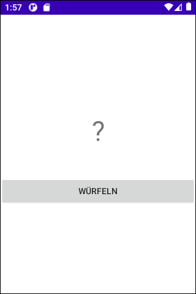
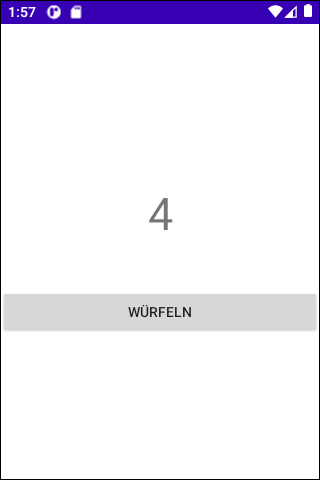

# Android-App "Würfel" (Fehlersuch-Aufgabe) #

 

Dieses Repository enthält eine einfache Android-App (native App mit Java), die einen Würfel mit sechs Seiten simuliert.

 

**!!! Die App stürzt beim Start ab, weil sie einen Fehler enthält; dieser Fehler soll in einem Programmierkurs als Übung gefunden werden !!!**

 

----

## Screenshots ##

 

 &nbsp;&nbsp; 

 

----

## License ##

 

See the [LICENSE file](LICENSE.md) for license rights and limitations (BSD 3-Clause License).

 
